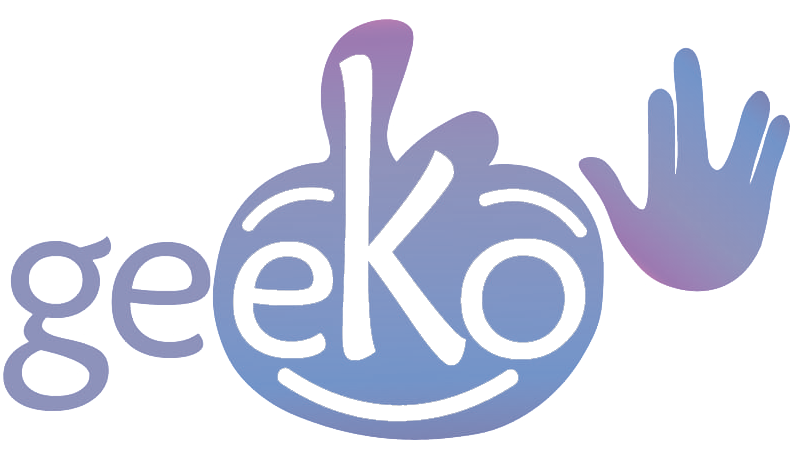
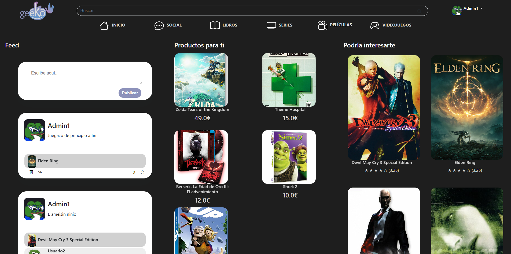
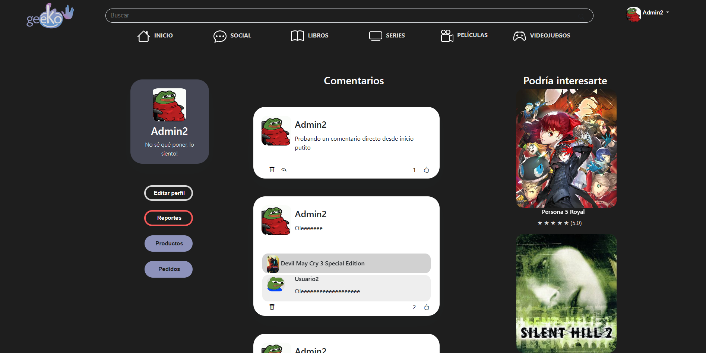
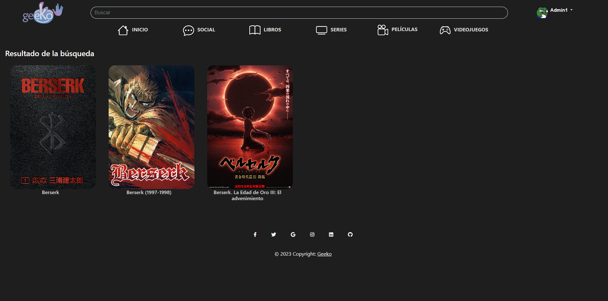
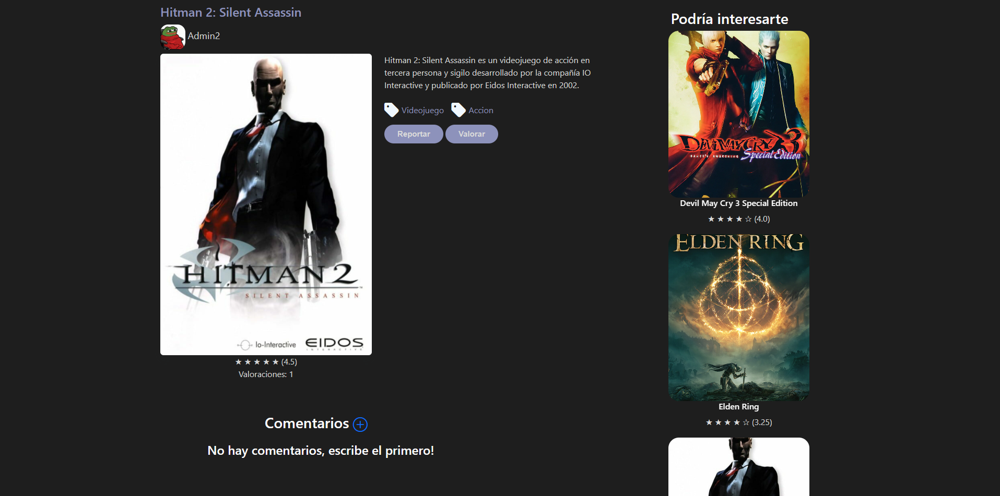
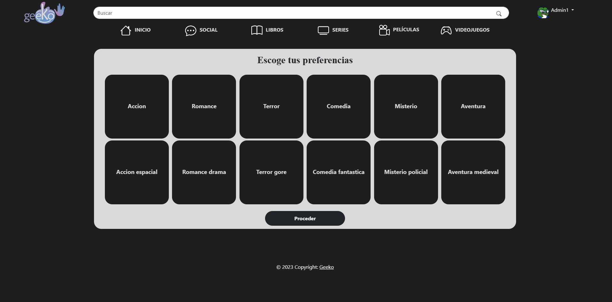

# Geeko

## ¿Qué es Geeko?
Geeko es una app web Java, enfocada a interactuar entre usuarios que comparten gustos y hobbies similares. También cuenta con acceso a tienda, permitiendo que los usuario vendan y compren diferentes artículos, ya sean películas, series, videojuegos o libros.

## ¿Cómo funciona?
Geeko cuenta con un sistema de registro y login seguros gracias a Spring Security, permitiendo que los usuarios puedan acceder a la app y a sus funcionalidades. Una vez dentro, los usuarios pueden acceder a su perfil, donde pueden ver sus datos, sus publicaciones, sus productos y sus compras. También pueden acceder a las diferentes secciones mediante la barra de navegación, donde pueden ver los productos disponibles, comprarlos o comentar. También pueden acceder a la sección de amigos, donde pueden ver a otros usuarios y añadirlos a su lista de amigos. Por último, pueden acceder a la sección de mensajes, donde pueden ver los mensajes que han recibido y enviar mensajes a otros usuarios.

### Inicio

### Perfil de un usuario

## ¿Cómo se ha hecho?
Geeko ha sido desarrollado con Java, utilizando Spring Boot y Spring Security para la parte del servidor, y Thymeleaf para la parte del cliente. También se ha utilizado una base de datos MySQL para almacenar los datos de los usuarios, los productos y los mensajes. Para el diseño de la app se ha utilizado Bootstrap, y para el logo se ha utilizado Adobe Illustrator. Además, se ha utilizado Figma para el diseño de las diferentes pantallas de la app. Por último, se ha utilizado Git y GitHub para la gestión del proyecto.

### Pantalla de resultado de una búsqueda

### Producto Geeko (no en venta)

## Más información
El proyecto se ha realizado como TFG del máster de Programación Java Web de la Escuela de Organización Industrial (EOI), partiendo de una base de conocimientos muy básica. Después de las más de 590 horas del máster, se ha conseguido desarrollar una app web completa, con un diseño atractivo y una funcionalidad completa. Se ha aprendido a utilizar Spring Boot, Spring Security, Thymeleaf, Bootstrap, MySQL y Figma, entre otras herramientas. También se ha aprendido a trabajar en equipo, utilizando Git y GitHub para la gestión del proyecto.

### Pantalla de preferencias la primera vez que se abre la app (modificable en perfil)

## Pantalla de videojuegos

## Estado del proyecto
El proyecto se encuentra en desarrollo, por lo que se irán añadiendo nuevas funcionalidades y mejorando las ya existentes a medida que se vayan adquiriendo conocimientos.
